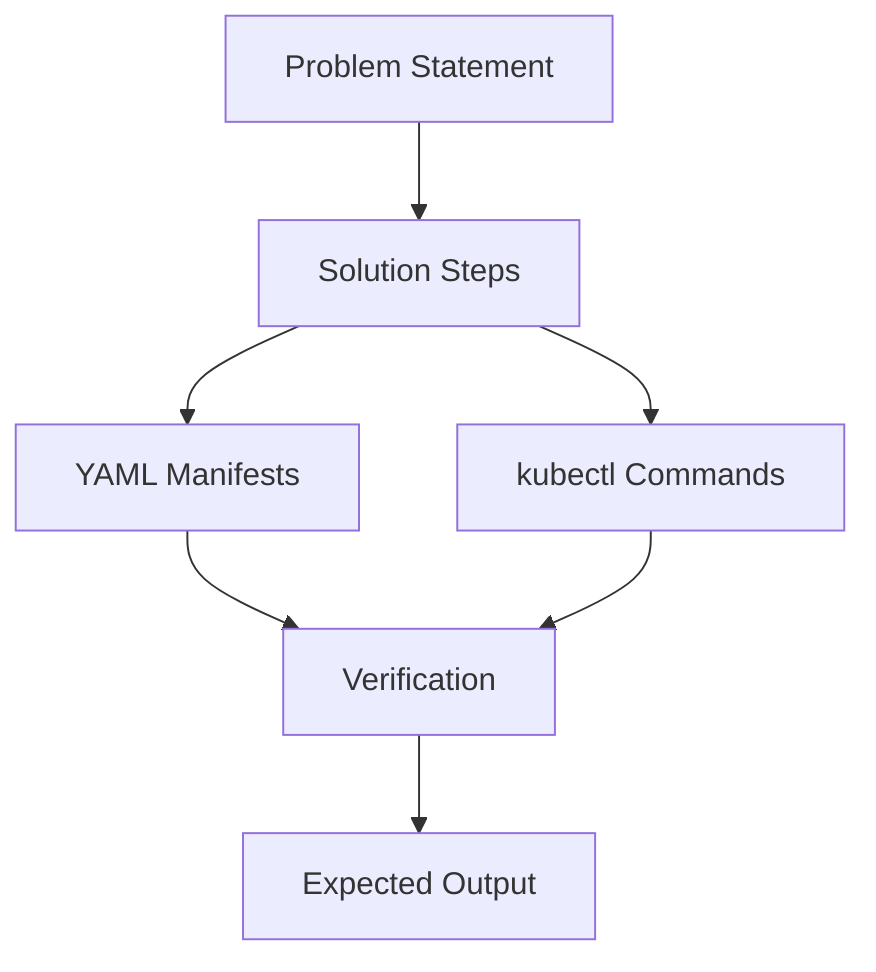

# System Patterns - CKAD Questions Repository

## Architecture Overview
The CKAD repository follows a domain-driven organization pattern, mirroring the official CKAD exam structure for intuitive navigation and study progression.

## Key Design Patterns

### Domain-Based Organization
```
questions/
├── domain-1-application-design-build/     # 20% of exam
├── domain-2-application-deployment/       # 20% of exam
├── domain-3-observability-maintenance/    # 15% of exam
├── domain-4-environment-config-security/  # 25% of exam
└── domain-5-services-networking/          # 20% of exam
```

### Question Structure Pattern
Each question follows a consistent format:
```
question-001-pod-creation/
├── README.md              # Problem statement
├── solution/
│   ├── README.md          # Step-by-step solution
│   ├── manifests/         # YAML files
│   └── commands.sh        # kubectl commands
└── examples/
    └── sample-output.txt  # Expected outputs
```

### Content Patterns

#### Question Complexity Levels
- **Basic (B)**: Single concept, straightforward implementation
- **Intermediate (I)**: Multiple concepts, moderate complexity
- **Advanced (A)**: Complex scenarios, multiple interconnected concepts

#### Naming Convention
- `question-[number]-[topic]-[difficulty]`
- Example: `question-001-pod-creation-B`
- Example: `question-045-networkpolicy-debug-A`

### Documentation Patterns

#### README Structure
```markdown
# Question Title
**Difficulty**: [Basic/Intermediate/Advanced]
**Domain**: [CKAD Domain Name]
**Time Limit**: [Suggested time in minutes]

## Scenario
[Real-world context]

## Task
[Specific requirements]

## Success Criteria
[How to verify completion]
```

## Component Relationships

### Question Flow


### Repository Navigation
- **By Domain**: Primary organization for systematic study
- **By Difficulty**: Progressive learning path
- **By Topic**: Cross-domain concept grouping
- **By Scenario**: Real-world use case grouping

## Critical Implementation Paths

### Content Validation Pipeline
1. **Syntax Check**: YAML and command validation
2. **Cluster Testing**: Verify against live Kubernetes
3. **Documentation Review**: Clarity and completeness
4. **Difficulty Assessment**: Appropriate complexity level

### Learning Progression
1. **Foundation**: Basic Kubernetes primitives
2. **Application**: Real-world scenarios
3. **Integration**: Multi-component solutions
4. **Troubleshooting**: Debug and fix scenarios

## Quality Assurance Patterns

### Testing Strategy
- All questions tested on multiple Kubernetes distributions
- Automated validation of YAML syntax
- Manual verification of step-by-step solutions
- Regular updates for Kubernetes version compatibility

### Content Standards
- Consistent formatting across all questions
- Clear, unambiguous problem statements
- Practical, exam-relevant scenarios
- Comprehensive solution explanations